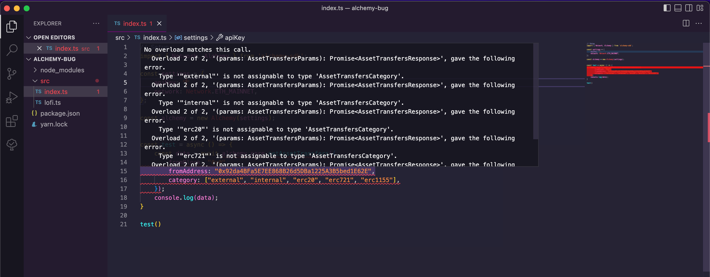
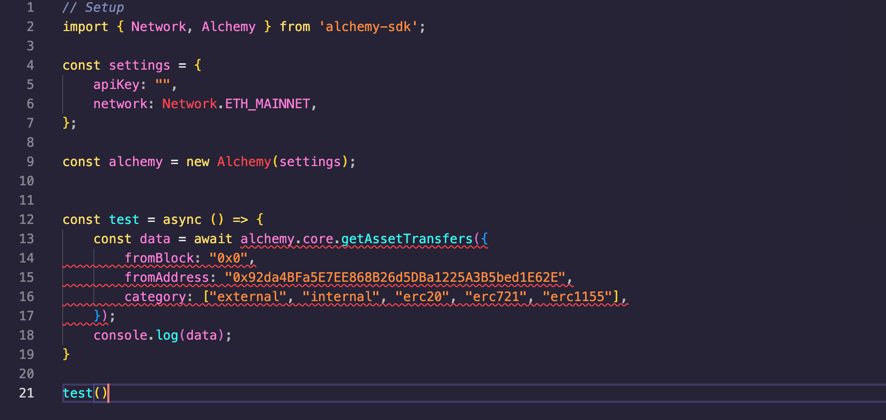
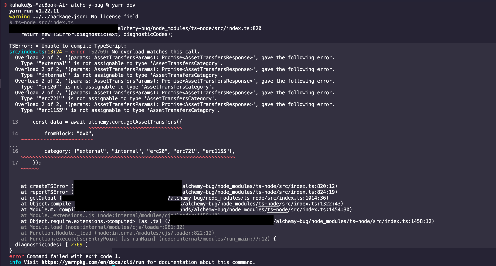

# Alchemy Bug

Proof of concept for the team that couldn't try the tutorial code.

Code was taken from the following tutorial:

https://docs.alchemy.com/docs/how-to-get-transaction-history-for-an-address-on-ethereum

## Installing the repo

```bash
yarn install
```

## Running the repo

Update your API key in the settings then run

```bash
yarn dev
```

## Error

On yarn run you will get the following issue:

```bash
TSError: ⨯ Unable to compile TypeScript:
src/index.ts:13:24 - error TS2769: No overload matches this call.
  Overload 2 of 2, '(params: AssetTransfersParams): Promise<AssetTransfersResponse>', gave the following error.
    Type '"external"' is not assignable to type 'AssetTransfersCategory'.
  Overload 2 of 2, '(params: AssetTransfersParams): Promise<AssetTransfersResponse>', gave the following error.
    Type '"internal"' is not assignable to type 'AssetTransfersCategory'.
  Overload 2 of 2, '(params: AssetTransfersParams): Promise<AssetTransfersResponse>', gave the following error.
    Type '"erc20"' is not assignable to type 'AssetTransfersCategory'.
  Overload 2 of 2, '(params: AssetTransfersParams): Promise<AssetTransfersResponse>', gave the following error.
    Type '"erc721"' is not assignable to type 'AssetTransfersCategory'.
  Overload 2 of 2, '(params: AssetTransfersParams): Promise<AssetTransfersResponse>', gave the following error.
    Type '"erc1155"' is not assignable to type 'AssetTransfersCategory'.
 13     const data = await alchemy.core.getAssetTransfers({
                           ~~~~~~~~~~~~~~~~~~~~~~~~~~~~~~~~
 14         fromBlock: "0x0",
    ~~~~~~~~~~~~~~~~~~~~~~~~~
...
 16         category: ["external", "internal", "erc20", "erc721", "erc1155"],
    ~~~~~~~~~~~~~~~~~~~~~~~~~~~~~~~~~~~~~~~~~~~~~~~~~~~~~~~~~~~~~~~~~~~~~~~~~
 17     });
    ~~~~~~
    at createTSError (/Users/kuhaku/Personal/crimson-lands/alchemy-bug/node_modules/ts-node/src/index.ts:820:12)
    at reportTSError (/Users/kuhaku/Personal/crimson-lands/alchemy-bug/node_modules/ts-node/src/index.ts:824:19)
    at getOutput (/Users/kuhaku/Personal/crimson-lands/alchemy-bug/node_modules/ts-node/src/index.ts:1014:36)
    at Object.compile (/Users/kuhaku/Personal/crimson-lands/alchemy-bug/node_modules/ts-node/src/index.ts:1322:43)
    at Module.m._compile (/Users/kuhaku/Personal/crimson-lands/alchemy-bug/node_modules/ts-node/src/index.ts:1454:30)
    at Module._extensions..js (node:internal/modules/cjs/loader:1159:10)
    at Object.require.extensions.<computed> [as .ts] (/Users/kuhaku/Personal/crimson-lands/alchemy-bug/node_modules/ts-node/src/index.ts:1458:12)
    at Module.load (node:internal/modules/cjs/loader:981:32)
    at Function.Module._load (node:internal/modules/cjs/loader:822:12)
    at Function.executeUserEntryPoint [as runMain] (node:internal/modules/run_main:77:12) {
  diagnosticCodes: [ 2769 ]
}
```

What does this mean that there is an error in the type library for alchemy.

## Screenshots






